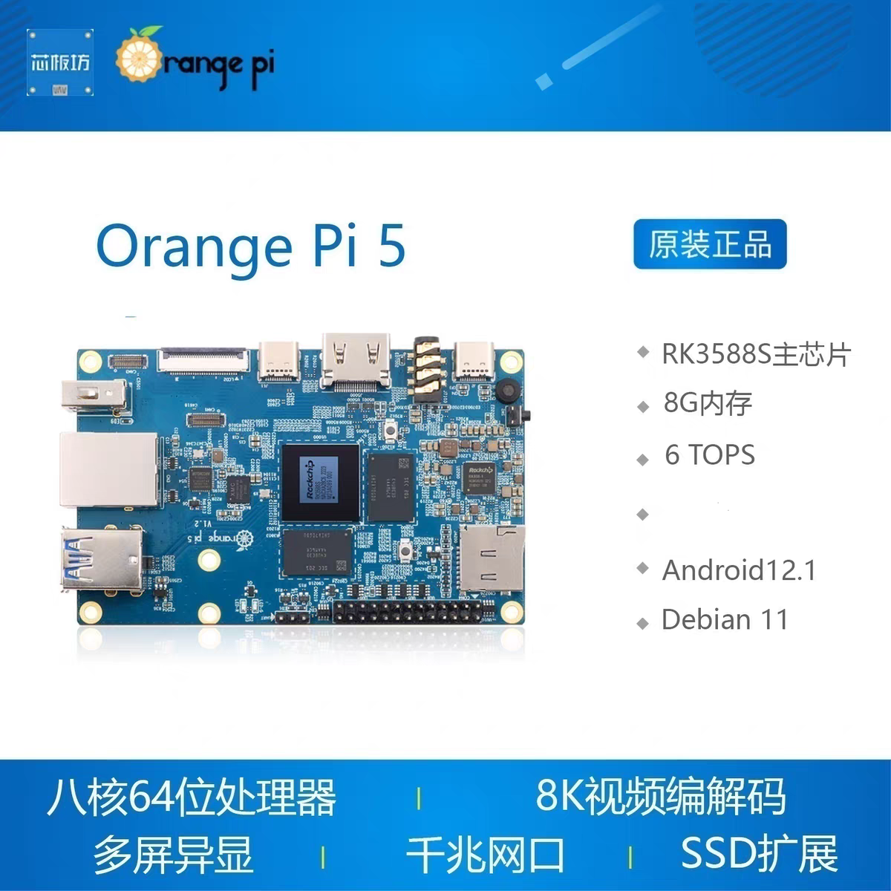

# 视觉代码

这是视觉部分代码，有什么注意的在这下面写出来。

形如:

......

    ------XXX

## 7.8

### 环境配置

创建虚拟环境：

`python -m venv "robogame_venv"`

虚拟环境激活：

`robogame_venv/Scripts/Activate`

退出：

`deactivate`

### 上位机,摄像头挑选

香橙派OrangePi 5(8G)+摄像头

——yrq
