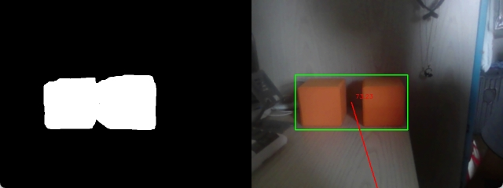
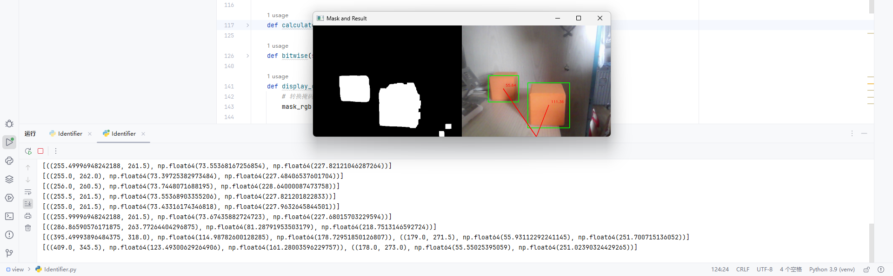
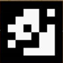
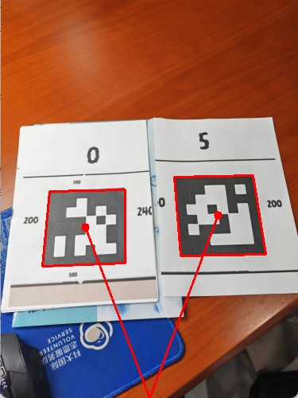
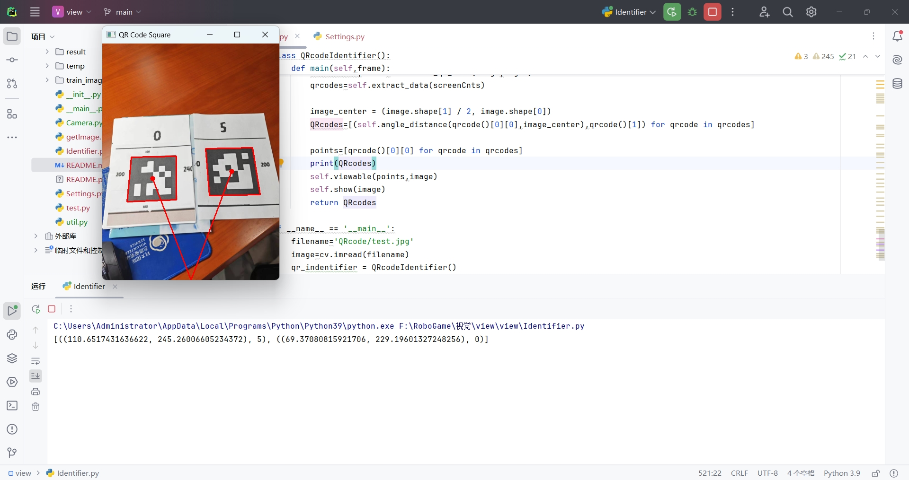
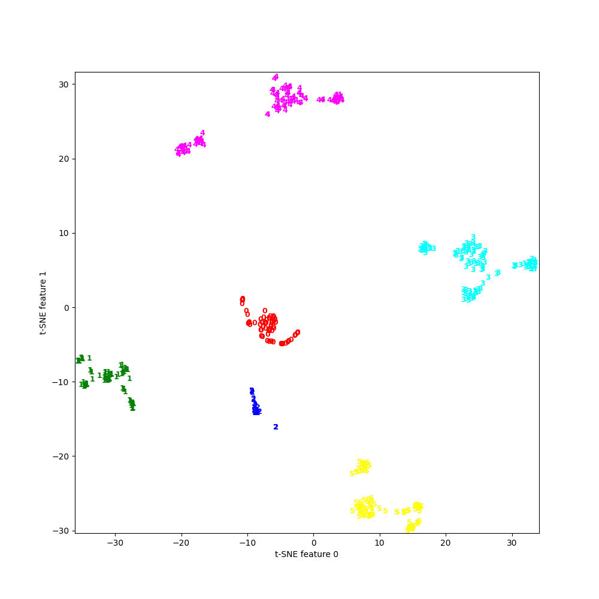

# 项目文件结构

```
├── test.py #测试
view/
│
├── result/#存储处理的结果
├── temp/#临时存储得到的结果
├── train_image/#测试用图片
│
├── __init__.py
├── __main.py__ #主程序，调用这个
├── Camera.py #视像头调用
├── Identifier.py #识别
├── Settings.py #基本配置
├── util.py #基本小工具
├── test.py #测试
├── ML.py #机器学习相关模型训练
│
├── README.md #说明
```

# 文件返回说明

以下内容均需要调整Settings.py的参数，根据场地具体的光线情况等

## Class Identifier()

### 功能

上面两个函数的整合

### 函数

main(filename)-> {
'cube':list(angle,distance)，
'line':int,
'qrcode':list[(angle,distance),type]
}

## Class LineIdentifier()

### 功能

识别巡航线的位置

### 函数

main(filename)->int

### param

filename:传入巡航线的图片

### return

0：中间（巡航线位于中间1/3）
1：右边（巡航线位于右1/3）
-1：左边（巡航线位于左1/3）·

### 测试代码

srcDir=Path('train_image')
filename='carview.jpg'
lineIdentifier = LineIdentifier()
print(lineIdentifier.main(filename))

## Class CubeIdentifier()

### 功能

识别方块的位置

### 函数

main(filename)->list(angle,distance)

### param

filename:传入图片地址

### return

方位角和距离的列表



## Class  QRcodeIdentifier()

### 函数

main(filename)->int

### param

frame:传入图片对象

### return

[(angle,distance),type]

type是对应的图片

0：


1:


2:


3：


4：


5：





补充：

这里QRcode识别最终放弃原来的图片矩阵的张量差的范数阈值比较，改为了PCA和随机森林法模型来预测




# 虚拟环境使用说明

## Windows系统

* 我们首先要在view文件夹打开命令行（powershell）
* 激活虚拟环境——在命令行里面输入:
  ```
  VIEW_ENV/Scripts/Activate
  ```
* 运行:
* ```
  python __main__.py
  ```
