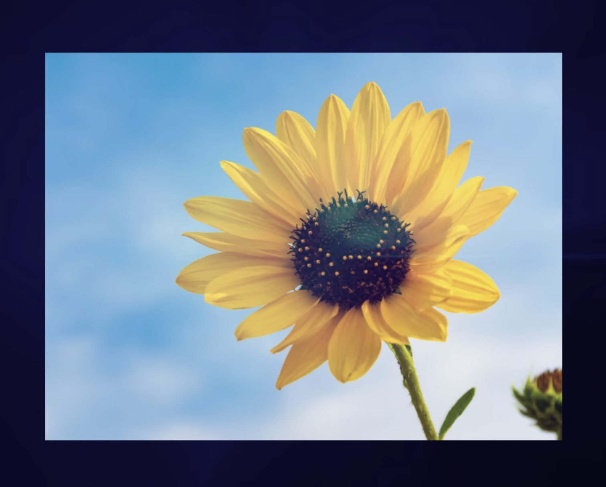
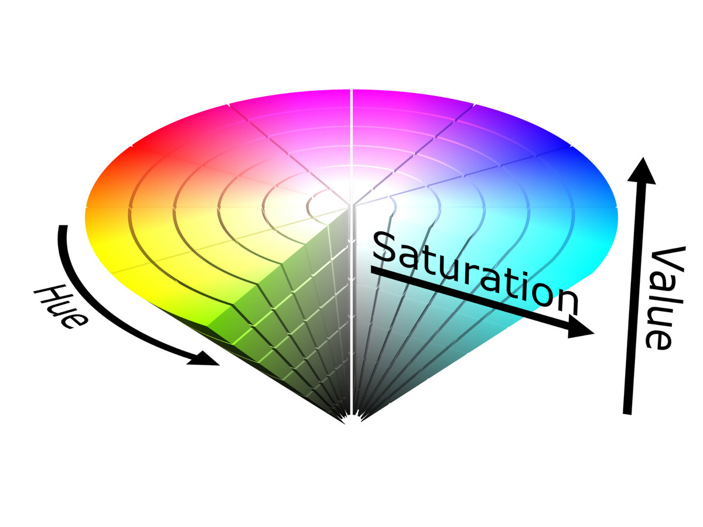

# 计算机视觉入门

**视觉 —— 人类 70% 的感知**

RoboGame 2024.7.15

---

# 相机成像

- 镜头：小孔成像 / 凸透镜成像

- 图像传感器： 光电转换

(图片源自：【一次性解决你关于微单的所有问题】https://www.bilibili.com/video/BV1kD421E7zz)

<!-- 凸透镜成像，光的三基色 -->

---

# 图像存储

- 像素（800x600）

- 通道（RGB, ARGB, HSV...）

| {width=300px lazy} | {width=300px lazy} |
|:---:|:---:|

(图片源自：【如何将图片转换为数字信息？看张量在数据处理中的应用】https://www.bilibili.com/video/BV1Kv4y1H73N)

<!-- 图片格式：bitmap / 压缩格式 -->

---

# 图像处理：用你的智慧提取所需信息

- **Q: 我们可以对图像进行哪些操作？**

    A: Photoshop, GIMP 等图片编辑软件基本涵盖了大部分对图片的操作

- **Q: 如何将处理过程自动化？**

    A: 借助 OpenCV 等图像处理库编写代码

---

# 提醒

1. 不要把问题想复杂，比赛的场景很简单。场景越简单（约束越多），问题就越容易解决。

2. 不要让代码工作在其适用范围之外

---

# 巡线

彩色图、灰度图、二值图

| {width=400px lazy} | {width=400px lazy} |
|:---:|:---:|

<!-- GIMP 的颜色菜单 / OpenCV cvtColor, threshold -->

---

# 简单场景、简单设问

| 描述场地上的线路情况？| 黑线在图像中心、偏左还是偏右？ |
|:---:|:---:|
| {width=300px lazy} | {width=400px lazy} |

<!-- 取决于实际的约束：相机安装位置 -->

---

# 颜色识别

色彩空间

- RGB
- HSV (hue-色相 saturation-饱和度 value-亮度)

{width=450px}

<!-- 1. GIMP 取色器
2. 类似直角坐标系和极坐标系的关系，三个正交分量 -->

---

# 颜色识别、蒙版(mask)与抠图

选取像素值在一定取值范围内的部分

| {width=400px lazy} | {width=400px lazy} | {width=400px lazy} |
|:---:|:---:|:---:|
